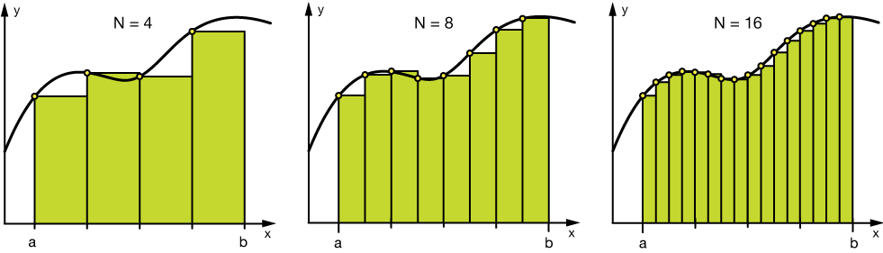

# FeatureEngineering


In this project, we will learn:
- what is feature engineering
- basic feature engineering techniques
- what is a feature store
- compare existing feature store solutions

# 1. What is feature engineering?

**Feature engineering** is a machine learning technique that takes a data set and constructs new `explanatory variables` (features)
that aren’t in the original training set. 

The goal of Feature engineering is to simplify and speed up data transformations while also enhance model accuracy.


This technique can be used for both `supervised and unsupervised learning`, a terrible feature will have a direct impact 
on your model accuracy regardless of your data and model.

For instance, in a house price data, you may have two column: 
- total_area: Total surface of the house
- living_area: Usable living surface of the house

The linear model will have difficulty to learn with the two column. But if we build a new feature:

`living_ratio=living_area/total_area`

With the domain knowledge of a real estate agent, we know the living_ratio has much more sense to predict the price of a house

## 1.1 Various feature engineering techniques

Feature engineering consists of various feature engineering techniques:

- **Feature Creation**: Creating features involves creating new variables by mixing existing features via operations (e.g. 
  addition, subtraction, multiplication, ratio, etc). The new derived features should have greater predictive power. 
  This is a subjective process that requires human intervention and creativity.   

- **Transformations**: Feature transformation involves manipulating the predictor variables to improve model 
    performance: 
    - ensuring the model is flexible in the variety of data it can ingest
    - ensuring variables are on the same scale, making the model easier to understand; 
    - improving accuracy; 
    - avoiding computational errors by ensuring all features are within an acceptable range for the model. 

- **Feature Extraction** (aka dimension reduction): Feature extraction is the process of extracting features from a data set to identify 
              useful information. Without distorting the original relationships or significant information, this 
              compresses the amount of data into manageable quantities for algorithms to process. Some feature extraction 
              methods include `cluster analysis, text analytics, edge detection algorithms, and principal components analysis`.

- **Feature Selection**: Feature selection algorithms essentially analyze, judge, and rank various features to 
            determine which features are irrelevant and should be removed, which features are redundant and should be 
            removed, and which features are most useful for the model and should be prioritized.

## 1.2 Steps in Feature Engineering

The art of feature engineering may vary among data scientists, however steps for how to perform feature engineering for 
most machine learning algorithms include the following:

- **Data Preparation**: This preprocessing step involves the manipulation and consolidation of raw data from 
                        different sources into a standardized format so that it can be used in a model. Data 
                        preparation may entail **data augmentation, cleaning, delivery, fusion, ingestion, and/or loading**. 
- **Exploratory Analysis**: This step is used to identify and summarize the main characteristics in a data set 
                        through data analysis and investigation. Data science experts use data visualizations to 
                       better understand how best to manipulate data sources, to determine which statistical 
                        techniques are most appropriate for data analysis, and for choosing the right features for a model. 
- **Benchmark**: Benchmarking is setting a baseline standard for accuracy to which all variables are compared. This 
                is done to reduce the rate of error and improve a model’s predictability. Experimentation, testing 
                and optimizing metrics for benchmarking is performed by data scientists with domain expertise and business users.

## 1.3 Importance Of Feature Engineering

Feature Engineering is a very important step in machine learning. It's a major factor that can impact the accuracy of 
a model. Below figure shows in general how much time a Data scientists spend on their project with data:


# 2.  Feature Engineering Techniques 

In section 1, we have seen the general categories of feature engineering techniques. Now let's check the some concret techniques.

Some techniques listed may work better with certain algorithms or datasets, while others may be useful in all situations.

## 2.1. Handle missing value

When it comes to preparing your data for machine learning, `missing values` are one of the most typical issues. It can 
be caused by Human errors, data flow interruptions, privacy concerns, etc. 

To handle these missing values, we can drop the row or column. If the drop is not allowed, we need to use imputation.

### 2.1.1 Drop

The most simple solution to the missing values is to drop the rows or the entire column. There is no optimum 
threshold for dropping. You need to make your own decision case by case. In general, you can use `70% ` as an 
**default threshold value** and try to drop the rows and columns which have missing values with higher than this threshold.

```python
import pandas as pd

threshold = 0.7
df = pd.read_csv(...)

#Dropping columns with missing value rate higher than threshold
df = df[df.columns[df.isnull().mean() < threshold]]

#Dropping rows with missing value rate higher than threshold
df = df.loc[df.isnull().mean(axis=1) < threshold]
```

### 2.1.2 Imputation

`Imputation is a more preferable option rather than dropping` because it preserves the data size. However, choosing the
imputation value is the most important steps in imputation.

In general, we only have one imputation value. In some case, you can have multiple imputation values, and replace missing
values with them by considering other columns.  


#### 2.1.2.1 Numerical Imputation

If the column has numerical type, the imputation is numerical. 

For example, if you have a column that only has 1 and NA, then it is likely that the NA rows correspond to 0. 
For another example, if you have a column that shows the “customer visit count in last month”, the missing values 
might be replaced with 0 as long as you think it is a sensible solution.

Another reason for the missing values is joining tables with different sizes and in this case, imputing 0 might be reasonable as well.

Except for the case of having a default value for missing values, I think the best imputation way is to use the 
medians of the columns. As the averages of the columns are sensitive to the outlier values, while medians are more 
solid in this respect.

```python
#Filling all missing values with 0
df = df.fillna(0)
#Filling missing values with medians of the columns
df = df.fillna(df.median())
```


#### 2.1.2.2 Categorical Imputation

When dealing with categorical columns, `replacing missing values with the highest value in the column` is a smart 
solution. However, if you believe the values in the column are evenly distributed and there is no dominating value, 
imputing a category like “Other” would be a better choice, as your imputation is more likely to converge to a random 
selection in this scenario.

```python
#Max fill function for categorical columns
df['column_name'].fillna(df['column_name'].value_counts().idxmax(), inplace=True)
```

## 2.2 Handling Outliers

### 2.2.1 Outliers detection

Before mentioning how outliers can be handled, I want to state that the best way to detect the outliers is to 
demonstrate the df **visually**. All other statistical methodologies are open to making mistakes, whereas visualizing 
the outliers gives a chance to take a decision with high precision. 

Statistical methodologies are less precise as data visualization, but they are fast. Here I will list two different 
ways of detecting outliers:

- standard deviation
- percentiles

#### 2.2.1.1 detect outliers with standard deviation

`If a value has a distance to the average higher than x * standard deviation, it can be assumed as an outlier`. 

Then what x should be?

There is no trivial solution for x, but usually, a value **between 2 and 4** seems practical.

Below example, we use 3 as factor value
```python
#Dropping the outlier rows with standard deviation
factor = 3
upper_lim = df['column'].mean () + df['column'].std () * factor
lower_lim = df['column'].mean () - df['column'].std () * factor

df = df[(df['column'] < upper_lim) & (df['column'] > lower_lim)]
```

In addition, **z-score** can be used instead of the formula above. **Z-score** (or standard score) standardizes 
the distance between a value and the mean using the standard deviation.

#### 2.2.1.2 Outlier Detection with Percentiles

Another mathematical method to detect outliers is to use `percentiles`. You can assume a certain percent of the value 
from the top or the bottom as an outlier. The key point is here to set the `percentage value`, and this depends on 
the distribution of your data as mentioned earlier.

Additionally, a common mistake is using the percentiles according to the range of the data. In other words, if your 
data ranges from 0 to 100, your top 5% is not the values between 96 and 100. Top 5% means here the values that are out 
of the 95th percentile of data.

```python
#Dropping the outlier rows with Percentiles
upper_lim = df['column'].quantile(.95)
lower_lim = df['column'].quantile(.05)

df = df[(df['column'] < upper_lim) & (df['column'] > lower_lim)]
```

### 2.2.2 Drop vs Cap

In above section, we dropped the outlier row. But this technique changes the size of your data.
Another option for handling outliers is to **cap** them instead of dropping. So you can keep your data size, it might 
be better for the final model performance.

On the other hand, **capping can affect the distribution of the data**, thus it better not to exaggerate it.

```python
#Capping the outlier rows with Percentiles
upper_lim = df['column'].quantile(.95)
lower_lim = df['column'].quantile(.05)
df.loc[(df[column] > upper_lim),column] = upper_lim
df.loc[(df[column] < lower_lim),column] = lower_lim
```

## 2.3 Binning

Binning can be applied on both categorical and numerical data. Below are some binning examples

```text
#Numerical Binning Example
Value      Bin       
0-30   ->  Low       
31-70  ->  Mid       
71-100 ->  High

#Categorical Binning Example
Value      Bin       
Spain  ->  Europe      
Italy  ->  Europe       
Chile  ->  South America
Brazil ->  South America
```


**The main motivation of binning is to make the model more robust and prevent overfitting**, however, it has a 
cost to the performance. Every time you bin something, you sacrifice information and make your data more regularized. 
(Please see [regularization in machine learning](https://towardsdatascience.com/regularization-in-machine-learning-76441ddcf99a))

Below figures shows the model fit on different binning size:


The trade-off between `performance` and `overfitting` is the key point of the binning process. In my opinion, for 
numerical columns, except for some obvious overfitting cases, binning might be redundant for some kind of algorithms, 
due to its effect on model performance.

However, for categorical columns, the labels with low frequencies probably affect the robustness of statistical 
models negatively. Thus, assigning a general category to these less frequent values helps to keep the robustness of 
the model. For example, if your data size is 100,000 rows, it might be a good option to unite the labels with a 
count less than 100 to a new category like “Other”.

```python
#Numerical Binning Example
df['bin'] = pd.cut(df['value'], bins=[0,30,70,100], labels=["Low", "Mid", "High"])


#Categorical Binning Example

conditions = [
    df['Country'].str.contains('Spain'),
    df['Country'].str.contains('Italy'),
    df['Country'].str.contains('Chile'),
    df['Country'].str.contains('Brazil')]

choices = ['Europe', 'Europe', 'South America', 'South America']

df['Continent'] = np.select(conditions, choices, default='Other')

```