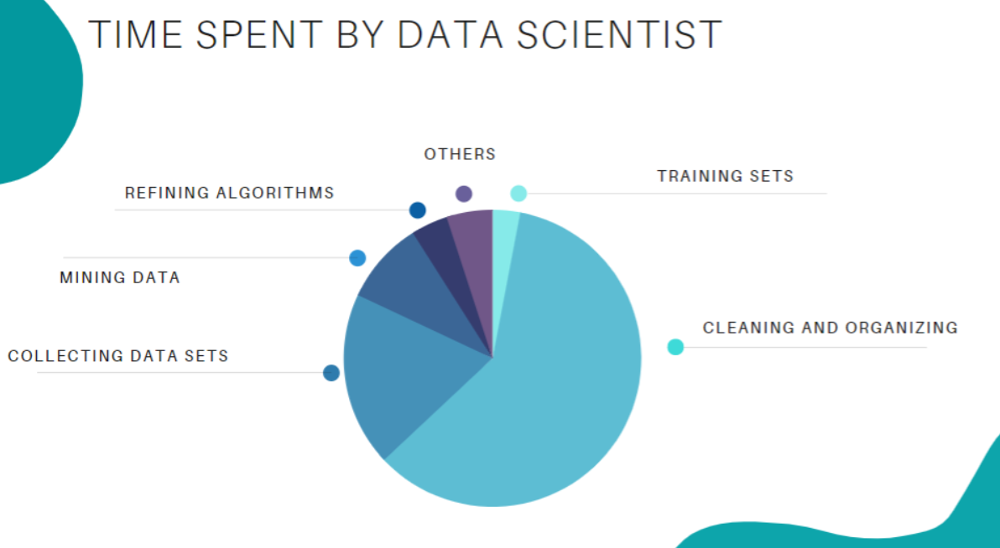
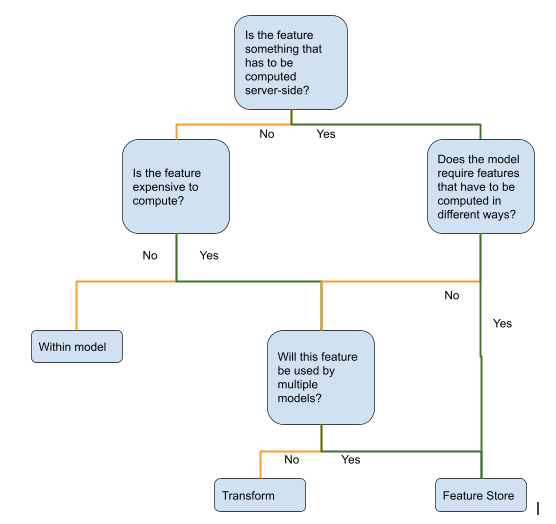

# Feature Engineering and all that

In this project, we will learn:
- what is feature engineering 
- basic feature engineering techniques
- what is a feature store
- compare existing feature store solutions
- feature management 

# 1. Feature engineering 

**Feature engineering** is a machine learning technique that takes a data set and constructs new `explanatory variables` (features)
that aren’t in the original training set. 

The goal of Feature engineering is to simplify and speed up data transformations while also enhance model accuracy.

This technique can be used for both `supervised and unsupervised learning`, a terrible feature will have a direct impact 
on your model accuracy regardless of your data and model.

For instance, in a house price data, you may have two column: 
- total_area: Total surface of the house
- living_area: Usable living surface of the house

The linear model will have difficulty to learn with the two column. But if we build a new feature:

`living_ratio=living_area/total_area`

With the domain knowledge of a real estate agent, we know the living_ratio has much more sense to predict the price of a house

## 1.1 Various feature engineering techniques

Feature engineering consists of various feature engineering techniques:

- **Feature Creation**: Creating features involves creating new variables by mixing existing features via operations (e.g. 
  addition, subtraction, multiplication, ratio, etc). The new derived features should have greater predictive power. 
  This is a subjective process that requires human intervention and creativity.   

- **Transformations**: Feature transformation involves manipulating the predictor variables to improve model 
    performance: 
    - ensuring the model is flexible in the variety of data it can ingest
    - ensuring variables are on the same scale, making the model easier to understand (min_max_normalization, z_score_normalization) 
    - improving accuracy; 
    - avoiding computational errors by ensuring all features are within an acceptable range for the model. 

- **Feature Extraction** (aka dimension reduction): Feature extraction is the process of extracting features from a data set to identify 
              useful information. Without distorting the original relationships or significant information, this 
              compresses the amount of data into manageable quantities for algorithms to process. Some feature extraction 
              methods include `cluster analysis, text analytics, edge detection algorithms, and principal components analysis`.

- **Feature Selection**: Feature selection algorithms essentially analyze, judge, and rank various features to 
            determine which features are irrelevant and should be removed, which features are redundant and should be 
            removed, and which features are most useful for the model and should be prioritized.

## 1.2 Steps in Feature Engineering

The art of feature engineering may vary among data scientists, however steps for how to perform feature engineering for 
most machine learning algorithms include the following:

- **Data Preparation**: This preprocessing step involves the manipulation and consolidation of raw data from 
                        different sources into a standardized format so that it can be used in a model. Data 
                        preparation may entail **data augmentation, cleaning, delivery, fusion, ingestion, and/or loading**. 
- **Exploratory Analysis**: This step is used to identify and summarize the main characteristics in a data set 
                        through data analysis and investigation. Data science experts use data visualizations to 
                       better understand how best to manipulate data sources, to determine which statistical 
                        techniques are most appropriate for data analysis, and for choosing the right features for a model. 
- **Benchmark**: Benchmarking is setting a baseline standard for accuracy to which all variables are compared. This 
                is done to reduce the rate of error and improve a model’s predictability. Experimentation, testing 
                and optimizing metrics for benchmarking is performed by data scientists with domain expertise and business users.

## 1.3 Importance Of Feature Engineering

Feature Engineering is a very important step in machine learning. It's a major factor that can impact the accuracy of 
a model. Below figure shows in general how much time a Data scientists spend on their project with data:

# 2. Feature engineering techniques 

[feature_engineering_techniques](docs/Feature_engnieering_intro.md)

# 3. What is a feature store?

A feature store creates a central place where different teams within an organization can share, build, and manage 
features – preventing the need to rebuild the same features. This allows organizations to save time, resources, 
ensure consistency of information, and scale their AI.

In implementation, the feature store is essentially a key-value database where the key consists of an entity 
(e.g. user_id) and a timestamp and the value consists of the properties of that entity (e.g. age, weight, height, sex, 
twitters of last hour, etc.) as-of that timestamp.

## 3.1 Feature store functionalities

### 3.1.1 Core Features

- Feature Registry/Search
- Feature Schema Versioning
- Offline Feature Store
- Online Feature Store
- Time Travel
- External feature group 
- Generate Training dataset with various File Formats (e.g. csv, parquet, avro, etc.)

### 3.1.2 Feature computation

- support feature engineer/computation framework (e.g. python, R, spark, etc.)
- streaming feature computation
- integrated feature data validation
- CI/CD Support
- 3rd Party tool Orchestration

### 3.1.3  Governance

- Authentication
- Access control
- Custom Metadata
- Feature Statistics
- Lineage

### 3.1.4 Data Ingestion
- Ingestion from various Streaming Sources
- Ingestion from various Batch Sources (e.g. s3, )

### 3.1.5 User Experience
- Web UI
- Feature Visualization

## 3.2 When to use a feature store?

### 3.2.1 Major challenges in ML 

#### 3.2.1.1 Training serving skew

The training data is preprocessed(e.g. normalization, feature splitting, etc.). If the 
incoming predication request (serving data) are not transformed with the same preprocessed step.
Otherwise, the accuracy of the predication will be corrupted. 

There are three ways to ensure that preprocessing done during training is repeated as-is during prediction: 
- Integrate preprocessing code within the model
- Define a transform function
- Using a feature store.

##### 3.2.1.1.1 Integrate preprocessing code within the model

The advantage of this method is the simplicity. Preprocessing code is inside the model. So, there is nothing 
special you have to do, the model contains all the necessary logic to preprocess the serving data.

The drawback is that the preprocessing steps will be wastefully repeated on each iteration through the training dataset. 
The more expensive the computation, the more this adds up.

Another drawback is that you have to implement the preprocessing code in the same framework as the ML model. 
If your preprocessing code uses custom libraries, this can become difficult.

##### 3.2.1.1.2 Define a transform function

Compare to integrated preprocessing solution, the standalone transform function can preprocess data and supply the 
transformed data to the model which is more efficient. Of course, we have to make sure to invoke 
that function from both training and prediction code. 

Alternatively, we have to capture the preprocessing steps in a container and interpose the container between 
the input and the model. While this adds efficiency, it also adds complexity — we have to make sure to save the 
transform function as an artifact associated with the model and know which transform function to invoke.

##### 3.2.1.1.3 Using a feature store

#### Data leakage

When we construct our training data set of past events, we must be sure to only use feature values 
that were known prior to each event. If the feature values are after the event, it's like we train the 
model with future data that should not exist. Thus, a `data leakage` is created. 

The outcome of **data leakage** would be models that seem to work great in offline validation tests, but act 
erratically in production. This is because the model got trained on information from the future that it 
won’t have during serving!

### 3.2.2 Situations that you need a feature store

#### Case 1 some feature value is unknown of the users 

In some case, when clients requesting predictions, they can't supply all the feature values. For example, the music
recommendation model needs the feature such as the songs that the client has listened last 30 days. The client can't 
provide these feature values. In this case, the feature store is essential to inject the feature values into 
incoming prediction requests. 

#### Case 2 Avoid data duplication

The second situation is to prevent unnecessary copies of the data. For example, consider that you have a feature that 
is computationally expensive and is used in multiple ML models. Rather than using a transform function and 
storing the transformed feature in multiple ML training datasets, it is much more efficient and maintainable 
to store it in a centralized repository. 

**Be careful about this — the increased efficiency may not be worth the increased complexity.**

#### Case 3 Features which are continually improved

For feature that is continually improved, a feature store is essential too. For example, for the recommendation model,
we have an embedding of a song, artist, and user. The user and song embeddings are updated on a daily basis. 
To ensure the accuracy, the model needs to be re-trained with the new feature values periodically (e.g. daily, weekly). 
The training code will need to fetch the values of this feature that align with the training labels and the latest 
version of the embedding algorithm. This has to be done efficiently and easily across all labels. And this has to be 
done across the tens or hundreds of features used by the model. The feature store makes periodic model re-training on 
hard-to-compute, frequently improved features exceptionally useful.

## 3.2.2 Decision Chart

Below figure is a decision tree to decide whether to use a feature store for the particular feature/model you are building.

Note even you have a feature store in your organization, you don't need to put all features in it.

## 3.3 When not to use a feature store
Below are some concrete situations where you don’t need a feature store. If your feature is

1. Known by the client.
2. In a data warehouse.
3. Not time dependent.
4. Needed by only batch serving.
5. Computationally inexpensive

# 4. Existing feature store

## 4.1 Feast
For more information of Feast, please check this doc [Feast feature store](feature_stores/01.Feast/Introduction.md)

## 4.2 Hopsworks

## 4.x Fully managed solutions
- Vertex AI feature store: GCP

## 4.x Internal implementations

- Palette: (Uber implementation)   
- Zipline: (Airbnb)
- Time Travel: Netflix

# 5. Feature management

You can consider a common feature store as a feature management system,   this means defining a feature creation lifecycle. If you unpack this, it includes defining:

A proper folder structure
Naming conventions and tagging
Feature versioning
Feature Services for feature consumption instead of purely Feature Views. This opens up interesting use-cases like Shadow Deployments.
Safely creating and updating features with authorization and automation (CI/CD)