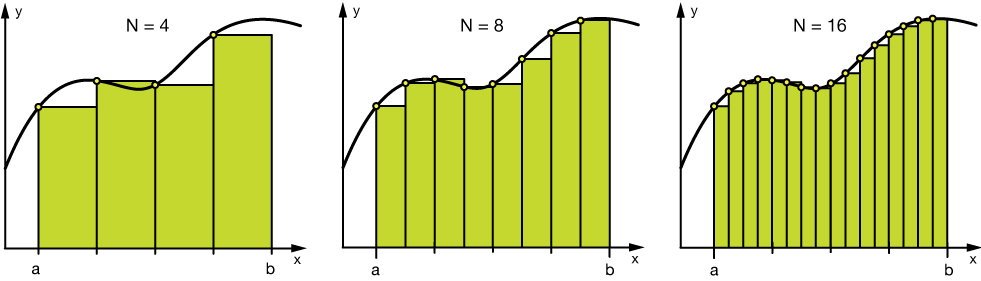

# 2.  Feature Engineering Techniques 

In section 1, we have seen the general categories of feature engineering techniques. Now let's check the some concret techniques.

Some techniques listed may work better with certain algorithms or datasets, while others may be useful in all situations.

- handling missing value
- handling outliers
- binning
- clustering
- log transform 
- encoding (one hot, target)
- Grouping Operations
- Feature Split
- Scaling
- Extracting Date

## 2.1. Handle missing value

When it comes to preparing your data for machine learning, `missing values` are one of the most typical issues. It can 
be caused by Human errors, data flow interruptions, privacy concerns, etc. 

To handle these missing values, we can drop the row or column. If the drop is not allowed, we need to use imputation.

### 2.1.1 Drop

The most simple solution to the missing values is to drop the rows or the entire column. There is no optimum 
threshold for dropping. You need to make your own decision case by case. In general, you can use `70% ` as an 
**default threshold value** and try to drop the rows and columns which have missing values with higher than this threshold.

```python
import pandas as pd

threshold = 0.7
df = pd.read_csv(...)

#Dropping columns with missing value rate higher than threshold
df = df[df.columns[df.isnull().mean() < threshold]]

#Dropping rows with missing value rate higher than threshold
df = df.loc[df.isnull().mean(axis=1) < threshold]
```

### 2.1.2 Imputation

`Imputation is a more preferable option rather than dropping` because it preserves the data size. However, choosing the
imputation value is the most important steps in imputation.

In general, we only have one imputation value. In some case, you can have multiple imputation values, and replace missing
values with them by considering other columns.  


#### 2.1.2.1 Numerical Imputation

If the column has numerical type, the imputation is numerical. 

For example, if you have a column that only has 1 and NA, then it is likely that the NA rows correspond to 0. 
For another example, if you have a column that shows the “customer visit count in last month”, the missing values 
might be replaced with 0 as long as you think it is a sensible solution.

Another reason for the missing values is joining tables with different sizes and in this case, imputing 0 might be reasonable as well.

Except for the case of having a default value for missing values, I think the best imputation way is to use the 
medians of the columns. As the averages of the columns are sensitive to the outlier values, while medians are more 
solid in this respect.

```python
#Filling all missing values with 0
df = df.fillna(0)
#Filling missing values with medians of the columns
df = df.fillna(df.median())
```


#### 2.1.2.2 Categorical Imputation

When dealing with categorical columns, `replacing missing values with the highest value in the column` is a smart 
solution. However, if you believe the values in the column are evenly distributed and there is no dominating value, 
imputing a category like “Other” would be a better choice, as your imputation is more likely to converge to a random 
selection in this scenario.

```python
#Max fill function for categorical columns
df['column_name'].fillna(df['column_name'].value_counts().idxmax(), inplace=True)
```

## 2.2 Handling Outliers

### 2.2.1 Outliers detection

Before mentioning how outliers can be handled, I want to state that the best way to detect the outliers is to 
demonstrate the df **visually**. All other statistical methodologies are open to making mistakes, whereas visualizing 
the outliers gives a chance to take a decision with high precision. 

Statistical methodologies are less precise as data visualization, but they are fast. Here I will list two different 
ways of detecting outliers:

- standard deviation
- percentiles

#### 2.2.1.1 detect outliers with standard deviation

`If a value has a distance to the average higher than x * standard deviation, it can be assumed as an outlier`. 

Then what x should be?

There is no trivial solution for x, but usually, a value **between 2 and 4** seems practical.

Below example, we use 3 as factor value
```python
#Dropping the outlier rows with standard deviation
factor = 3
upper_lim = df['column'].mean () + df['column'].std () * factor
lower_lim = df['column'].mean () - df['column'].std () * factor

df = df[(df['column'] < upper_lim) & (df['column'] > lower_lim)]
```

In addition, **z-score** can be used instead of the formula above. **Z-score** (or standard score) standardizes 
the distance between a value and the mean using the standard deviation.

#### 2.2.1.2 Outlier Detection with Percentiles

Another mathematical method to detect outliers is to use `percentiles`. You can assume a certain percent of the value 
from the top or the bottom as an outlier. The key point is here to set the `percentage value`, and this depends on 
the distribution of your data as mentioned earlier.

Additionally, a common mistake is using the percentiles according to the range of the data. In other words, if your 
data ranges from 0 to 100, your top 5% is not the values between 96 and 100. Top 5% means here the values that are out 
of the 95th percentile of data.

```python
#Dropping the outlier rows with Percentiles
upper_lim = df['column'].quantile(.95)
lower_lim = df['column'].quantile(.05)

df = df[(df['column'] < upper_lim) & (df['column'] > lower_lim)]
```

### 2.2.2 Drop vs Cap

In above section, we dropped the outlier row. But this technique changes the size of your data.
Another option for handling outliers is to **cap** them instead of dropping. So you can keep your data size, it might 
be better for the final model performance.

On the other hand, **capping can affect the distribution of the data**, thus it better not to exaggerate it.

```python
#Capping the outlier rows with Percentiles
upper_lim = df['column'].quantile(.95)
lower_lim = df['column'].quantile(.05)
df.loc[(df[column] > upper_lim),column] = upper_lim
df.loc[(df[column] < lower_lim),column] = lower_lim
```

## 2.3 Binning

Binning can be applied on both categorical and numerical data. Below are some binning examples

```text
#Numerical Binning Example
Value      Bin       
0-30   ->  Low       
31-70  ->  Mid       
71-100 ->  High

#Categorical Binning Example
Value      Bin       
Spain  ->  Europe      
Italy  ->  Europe       
Chile  ->  South America
Brazil ->  South America
```


**The main motivation of binning is to make the model more robust and prevent overfitting**, however, it has a 
cost to the performance. Every time you bin something, you sacrifice information and make your data more regularized. 
(Please see [regularization in machine learning](https://towardsdatascience.com/regularization-in-machine-learning-76441ddcf99a))

Below figures shows the model fit on different binning size:


The trade-off between `performance` and `overfitting` is the key point of the binning process. In my opinion, for 
numerical columns, except for some obvious overfitting cases, binning might be redundant for some kind of algorithms, 
due to its effect on model performance.

However, for categorical columns, the labels with low frequencies probably affect the robustness of statistical 
models negatively. Thus, assigning a general category to these less frequent values helps to keep the robustness of 
the model. For example, if your data size is 100,000 rows, it might be a good option to unite the labels with a 
count less than 100 to a new category like “Other”.

```python
#Numerical Binning Example
df['bin'] = pd.cut(df['value'], bins=[0,30,70,100], labels=["Low", "Mid", "High"])


#Categorical Binning Example

conditions = [
    df['Country'].str.contains('Spain'),
    df['Country'].str.contains('Italy'),
    df['Country'].str.contains('Chile'),
    df['Country'].str.contains('Brazil')]

choices = ['Europe', 'Europe', 'South America', 'South America']

df['Continent'] = np.select(conditions, choices, default='Other')

```

## 2.4 Log Transform

Logarithm transformation (or log transform) is one of the `most commonly used mathematical transformations` in 
feature engineering. What are the benefits of log transform:

- It helps to handle skewed data and after transformation, the distribution becomes more approximate to normal.
- In most of the cases the magnitude order of the data changes within the range of the data. For instance, the 
  difference between ages `15 and 20` is not equal to the ages `65 and 70`. In terms of years, yes, they are identical, 
  but for all other aspects, `5 years of difference in young ages mean a higher magnitude difference`. This type of 
  data comes from a multiplicative process and log transform normalizes the magnitude differences like that.
- It also decreases the effect of the outliers, due to the normalization of magnitude differences and the model 
  become more robust.

**A critical note**: The data you apply log transform must have only positive values, otherwise you receive an error. 
  Also, you can add 1 to your data before transform it. Thus, you ensure the output of the transformation to be positive.

### Application example: Log(x+1)

```python
data = pd.DataFrame({'value':[2,45, -23, 85, 28, 2, 35, -12]})
data['log+1'] = (data['value']+1).transform(np.log)
#Negative Values Handling
#Note that the values are different
data['log'] = (data['value']-data['value'].min()+1) .transform(np.log)
```

output :

```text
   value  log(x+1)  log(x-min(x)+1)
0      2   1.09861          3.25810
1     45   3.82864          4.23411
2    -23       nan          0.00000
3     85   4.45435          4.69135
4     28   3.36730          3.95124
5      2   1.09861          3.25810
6     35   3.58352          4.07754
7    -12       nan          2.48491
```

## 2.5 Encoding

As we know, most ML model only reads numeric value, for String column (e.g. Categorical), we need to encode it with a
numeric value. It exists several standard encoding technique:
- onehot encoding
- label encoding
- feature hash encoding
- Leave One Out Encoding
- target encoding

Below figure shows how you can choose an encoding technique base on your feature properties.

### 2.5.1 One-hot encoding

**One-hot encoding** is one of the most common encoding methods in machine learning. This method spreads the values in 
a column to multiple flag columns and assigns `0` or `1` to them. These binary values express the relationship between 
grouped and encoded column.

This method changes your categorical data, which is challenging to understand for algorithms, to a numerical format 
and enables you to group your categorical data without losing any information. 

Why One-Hot?: If you have `N distinct values` in the column, it is enough to map them to `N-1 binary columns`, because 
the missing value can be deducted from other columns. If all the columns in our hand are equal to 0, the missing 
value must be equal to 1. This is the reason why it is called as one-hot encoding.

Below figure shows an example of one-hot encoding, the City Column contains three distinct value:
- Istanbul
- Madrid
- Roma

As we mentioned, we only need `N-1` (two) distinct value to encode the city column. 


Below code shows how to do one-hot encoding with pandas

```python
encoded_columns = pd.get_dummies(df['column'])
df = df.join(encoded_columns).drop('column', axis=1)
```
### 2.5.2 Label Encoding

Label Encoding is similar to one hot encoding, that it has a little difference. The transformed encoded numerical 
values only stays in one column, it does not generate additional column. The image below shows an example.


As we can see from the image above, the categorical column transformed into a numerical value 
(Primary School = 1, High School = 2, and so on).

Note: **Label Encoding is mostly only applicable for the Ordinal or categorical data with meaningful order**. 

In the example above, I assume that the 'Education' data is Ordinal data because there is a significant order 
between the values(Master>High school>primary). 

Additionally, Label Encoding would produce an equal space between the numerical value (e.g. the cap between bachelor to high school, 
and high school to primary is equal). So if you feel your categorical data order is not similar, then 
Label Encoding might not capture that information.

**Why is Label Encoding not applicable to the non-ordinal data?** 
Because it causes a prioritization issue. The machine learning model would often generalize high value with a higher 
priority than the lower value — and if our categorical value doesn't have any meaningful order but treat it as it 
has one, it would distort the information. For example, if we use label encoding on the location data, the model will
consider Paris->3 is better than london->2. However, the location of the user does not have order.

Below code shows an example of sklearn package

```python
from sklearn import preprocessing
le = preprocessing.LabelEncoder()
mpg['origin_le'] = le.fit_transform(mpg['origin'])
mpg.sample(5)
```

However, the Label Encoder from Sklearn substitutes the data only by using the alphabetical information, 
which might be wrong in the ordinal data case. That is why I often create my transformer rather than relying on 
the package's function.

Although, if you want to rely on Sklearn; it provides OrdinalEncoder class that could transform the 
category into the label we assigned.

### 2.5.3 3. Feature Hash Encoding

**One-Hot Encoding's major weakness is the features it produced are equivalent to the categorical cardinal**, 
which causes dimensionality issues when the cardinality is too high. One way to alleviate this problem is to represent 
the categorical data into a lesser number of columns, and that is what **Feature Hash Encoding** did.

Hash Encoding represents the categorical data into numerical value by the hashing function. Hashing is often used in 
data encryption or data comparison, but the main part is still similar — transform one feature to another using 
hashing function.

I would not explain in deep regarding the hashing process, but you could read this following paper to understand one 
of the most used hashing functions, md5.

The main advantage of using Hash Encoding is that you can control the number of numerical columns produced by 
the process. You could represent categorical data with 25 or 50 values with five columns (or any number you want). 

Let's try to do Hash Encoding by using the **category_encoders** Python package.
It contains many functions for the Categorical Encoding process and works well with the **Featuretools** package 
(The category_encoders package developed to work with the Featuretools). You could check this 
[article](https://towardsdatascience.com/easy-automated-feature-engineering-for-machine-learning-model-ea00c5059dd6) to 
know what is Featuretools did.

Using the category_encoders, let's try to Hash Encode the category data in the sample mpg dataset. Our dataset has 
'model_year' data with 13 cardinal, and I want to transform it into five numerical features. 
To do that, we could try the following code.

```python
# pip install category_encoders
import category_encoders as ce
encoder=ce.HashingEncoder(cols='model_year',n_components=5)
hash_res = encoder.fit_transform(mpg['model_year'])
hash_res.sample(5

pd.concat([encoder.fit_transform(mpg['model_year']), mpg], axis =1).sample(5)
```

However, Hash Encoding has two significant weaknesses. 
- First, because we transform the data into fewer features, there would be an information loss. 
- Second, since a high number of categorical values are represented into a smaller number of features, 
  different categorical values could be represented by the same Hash values — this is called a **collision**.

But, many Kaggle competitors use Hash Encoding to win the competition, so it is worth a try.

### 2.5.4 Target encoding
Please check this [notebook](../notebooks/06.Target_encoding.ipynb) for target encoding.

### 2.5.5. Leave One Out Encoding (LOOE)

**Leave One Out Encoding** is similar to Target Encoding, but it adds one more step to handle overfitting. 
To understand the LOOE process, let me try to explain the target encoding concept first. The target encoding 
technique is a categorical encoding that transforms the categorical data into numerical value using the target (y) 
information. Let's use a sample image to understand the concept better.


## 2.6 Grouping Operations

In most machine learning algorithms, every instance is represented by a row in the training dataset, where every column
show a different feature of the instance. This kind of data are called **Tidy datasets (each variable is a column, each
observation is a row, and each type of observation unit is a table)**. For more information about tidy dataset, you can
check this [paper](http://vita.had.co.nz/papers/tidy-data.pdf)

However, Datasets such as transactions rarely fit the definition of tidy data above, because of the multiple rows of 
an instance. And we need to transform them to `Tidy datasets`.

Below figure shows a dataset that describes the number of visit for each city, We have multiple rows that represents the
same user. 


In this [notebook](notebooks/07.Feature_grouping.ipynb), you can find more details on grouping operations.

## 2.7 Splitting feature

Sometimes, multiple information may be stored in the same column, this also violates the tidy dataset principal. To make
each column represent a single feature, we need to split this kind of columns.

For example, we have a user-name column that has values such as
- Mr Charlie dupont
- Ms Alice Doe
- Mme Sara Doe

We can notice, the title contains the information about the sex of the user. So we need to split the title from the name
For more detail, please read this [notebook](notebooks/08.Feature_splitting.ipynb)

## 2.8 Scaling

In most cases, the numerical features of the dataset do not have a certain **range** and they differ from each other. 
In real life, it is nonsense to expect `age` and `income` columns to have the same range. But from the machine 
learning point of view, how these two columns can be compared?

`Scaling` solves this problem. The continuous features become identical in terms of the range, after a scaling process. 
This process is not mandatory for many algorithms, but it might be still nice to apply. However, the algorithms 
based on **distance calculations** such as `k-NN` or `k-Means` need to have scaled continuous features as model input.

**Basically, there are two common ways of scaling**

### 2.8.1 Normalization

**Normalization (or min-max normalization)** scale all values in a fixed range between `0` and `1`. **This 
transformation does not change the distribution of the feature and due to the decreased standard deviations, 
the effects of the outliers increases. Therefore, before normalization, it is recommended to handle the outliers.**

Below figure shows the formule:


### 2.8.2 Standardization

**Standardization (or z-score normalization)** scales the values while taking into account standard deviation. 
If the standard deviation of features is different, their range also would differ from each other. This reduces 
the effect of the outliers in the features.

In the following formula of standardization, the `mean` is shown as `μ` and the `standard deviation` is shown as `σ`.


For code example, please visit this [notebook](notebooks/09.Scalling.ipynb)
## 2.9 Working with date/time

Though date columns usually provide valuable information about the model target, they are neglected as an input or 
used nonsensically for the machine learning algorithms. 

In general, dates are in various formats (e.g. YYYY-mm-dd, dd-mm-YYYY) and formats (e.g string, linux time stamp), 
which make it hard to understand by algorithms.

Building an ordinal relationship between the values is very challenging for a machine learning algorithm if you 
leave the date columns without manipulation. 

In general, we can use three types of preprocessing for dates:

- Extracting the parts of the date into different columns: Year, month, day, etc.
- Extracting the time period between the current date and columns in terms of years, months, days, etc.
- Extracting some specific features from the date: Name of the weekday, Weekend or not, holiday or not, etc.

Extracting the parts of the date into different columns: Year, month, day, etc.
Extracting the time period between the current date and columns in terms of years, months, days, etc.
Extracting some specific features from the date: Name of the weekday, Weekend or not, holiday or not, etc.