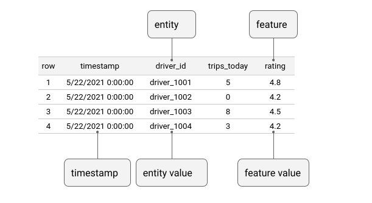
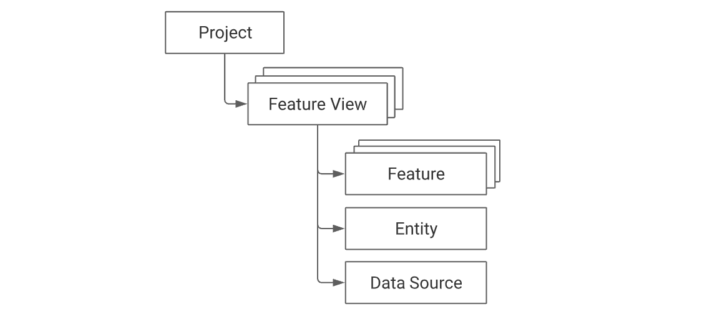

# Feast introduction

**Feast (Feature Store)** is an operational data system for managing and serving machine learning features to 
models in production. Feast is able to serve feature data to models from a low-latency online store 
(for real-time prediction) or from an offline store (for scale-out batch scoring or model training).

Below is the general architecture of feast

## Data model

**Feast uses a time-series data model to represent data.** This data model is used to interpret feature data in 
data sources in order to build training datasets or when materializing features into an online store.

Below is an example data source with a single entity (driver) and two features (trips_today, and rating).

You can notice each line represent a record which contains 
- timestamp: timestamp of the record
- entity value: is the unique identifier of each record. 
- a list of feature values:

## Feast key Concepts

Feast contains the following key concepts:

- Project
- Feature view
- Data source
- Feature
- Dataset
- Entity
- Stream feature view
- Feature retrieval
- Point-in-time joins
- Registry

### General Organization 

- **Project** is the top-level namespace within Feast. 
- A project contains one or more **feature views**. 
- A feature view contains one or more **features**. 
- A feature view must always have a **data source**, which in turn is used during the generation of training datasets 
    and when materializing feature values into the online store.
- A Feature must relate to at least one **entity** (multiple entities are allowed).

**Projects provide complete isolation of feature stores at the infrastructure level**. 
It is not possible to retrieve features from multiple projects in a single request. 
We recommend having a single feature store and a single project per environment (dev, staging, prod).

