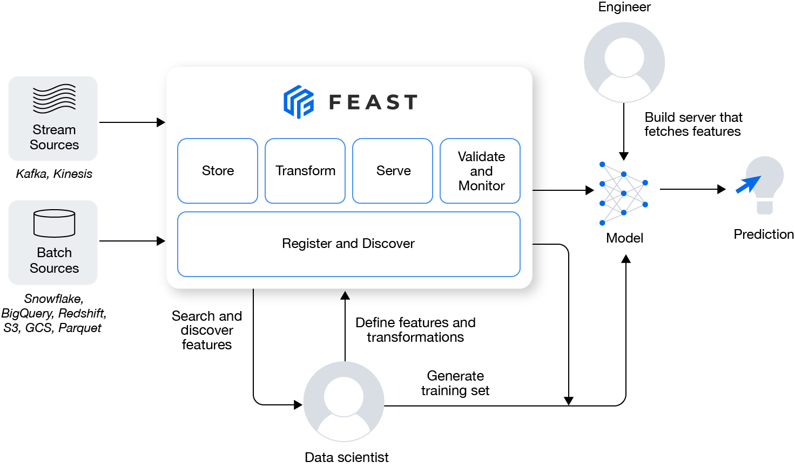

# Feast introduction

**Feast (Feature Store)** is an operational data system for managing and serving machine learning features to 
models in production. Feast is able to serve feature data to models from a low-latency online store 
(for real-time prediction) or from an offline store (for scale-out batch scoring or model training).

Below is the general architecture of feast

## Data model

**Feast uses a time-series data model to represent data.** This data model is used to interpret feature data in 
data sources in order to build training datasets or when materializing features into an online store.

Below is an example data source with a single entity (driver) and two features (trips_today, and rating).

You can notice each line represent a record which contains 
- timestamp: timestamp of the record
- entity value: is the unique identifier of each record. 
- a list of feature values:

## Feast key Concepts

Feast contains the following key concepts:

- Project : A project is a collection of related features and their data sources. Projects are isolated from each 
            other, and you can’t reuse features from one project in another. As of version 0.19.3, projects were 
            supported to ensure backward compatibility with previous versions of Feast. The concept of projects 
                might change as Feast developers simplify the framework.
- Feature view : A feature view is a group of feature data from a specific data source. Feature views allow you to 
                 consistently define features and their data sources, enabling the reuse of feature groups across a 
                 project. If your features are stored in more than one location, you can specify a feature view for 
                 each location and later join all the features together. Feature views make the addition of new features 
                  to your existing data very easy as well — as you gather new groups of features, you can create 
                 separate feature views for them and then merge them with your old data.
- Data source: In Feast, each feature view has a data source. A data source is where the raw feature data is stored, 
               like a local .parquet file or a s3 bucket. You can have as many data sources as you want, but you 
               can’t mix different types of sources together.
- Feature Service: A feature service is an object that contains features from one or more feature views. 
                You can use feature services to create logically related groups of feature views.
- Dataset : A dataset is a group of feature views and entities. Feast datasets allow engineers to combine data from 
            different feature views for analysis and training.
- Entity : The Feast docs describe entities as a collection of semantically related features. In practical terms, 
           entities can be the individuals or objects that your feature data relates to. As an example, if you 
             have a pneumonia dataset, you can set your patients as your entities and assign unique IDs to them for 
             identification. You can then use the IDs to store and retrieve specific feature values. Feast also uses 
             entities to correctly join data from different feature views.
- Stream feature view
- Feature retrieval
- Point-in-time joins
- Registry
- timestamp: Feast uses timestamps to ensure that features from different sources are joined in the correct 
             chronological order. Primarily, this is so that you can avoid using very old data for
             training or prediction.
### General Organization 

- **Project** is the top-level namespace within Feast. 
- A project contains one or more **feature views**. 
- A feature view contains one or more **features**. 
- A feature view must always have a **data source**, which in turn is used during the generation of training datasets 
    and when materializing feature values into the online store.
- A Feature must relate to at least one **entity** (multiple entities are allowed).

**Projects provide complete isolation of feature stores at the infrastructure level**. 
It is not possible to retrieve features from multiple projects in a single request. 
We recommend having a single feature store and a single project per environment (dev, staging, prod).

## Feast infrastructure

Below figure shows the main component of feast infrastructure

- Offline store: The offline store is where you store your features. In the terminology of Feast, the offline 
                 store contains historical features that you can use for analysis or training. Feast can both 
                  retrieve and write data to the offline store. This type of store is “offline” because it is 
                  located outside a Feast environment. **It's for generating training data (training phase)**

- Online store: The online store is where Feast stores features for low-latency access. The online store is designed to 
                complete prediction request (serving phase).

- Feature repo: A feature repository contains the definitions of a Feast feature store. It defines where features 
                are stored, how they should be retrieved, and what they contain. If your offline store is on your 
                local machine, a feature repository can also contain the raw feature data.

- Registry: A registry is a catalog of feature definitions and their metadata. It defines the infrastructure of your 
            feature repository and where feature data comes from.

- Provider: A provider is the implementation of a specific offline or online feature store. Feast has specialized 
            providers for AWS, GCP, and local environments.